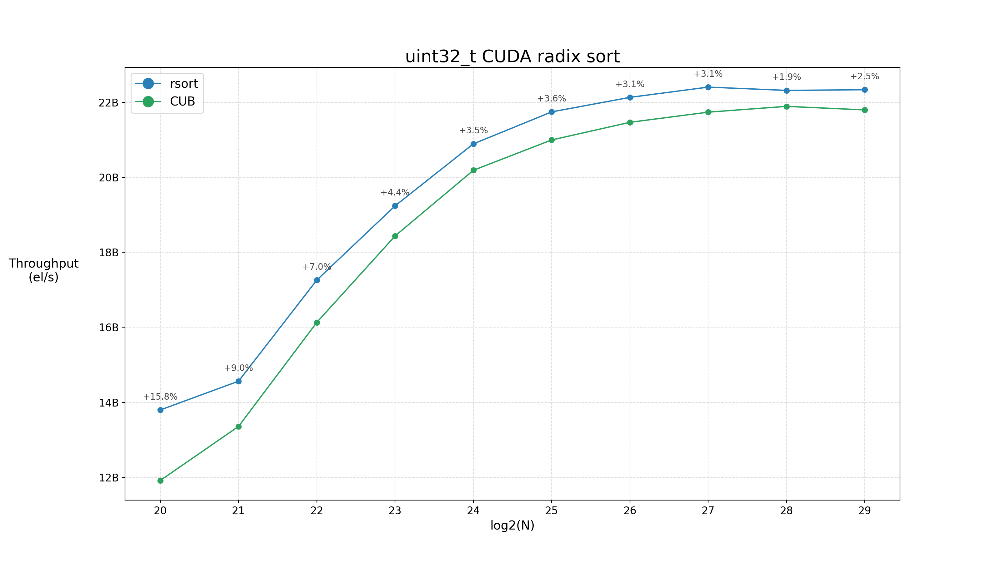
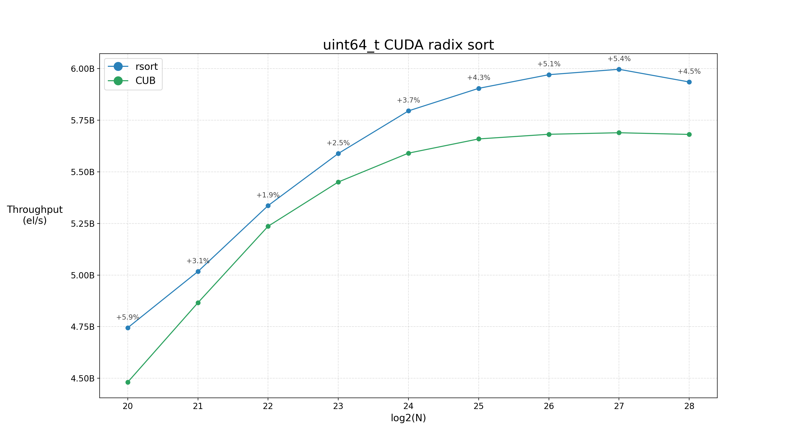
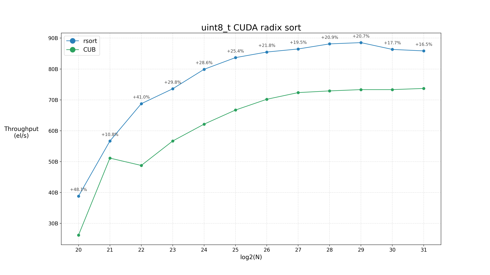
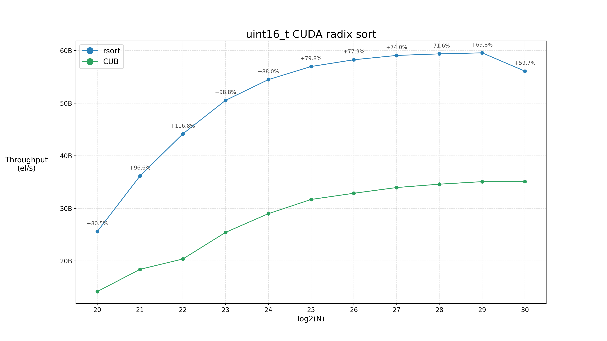
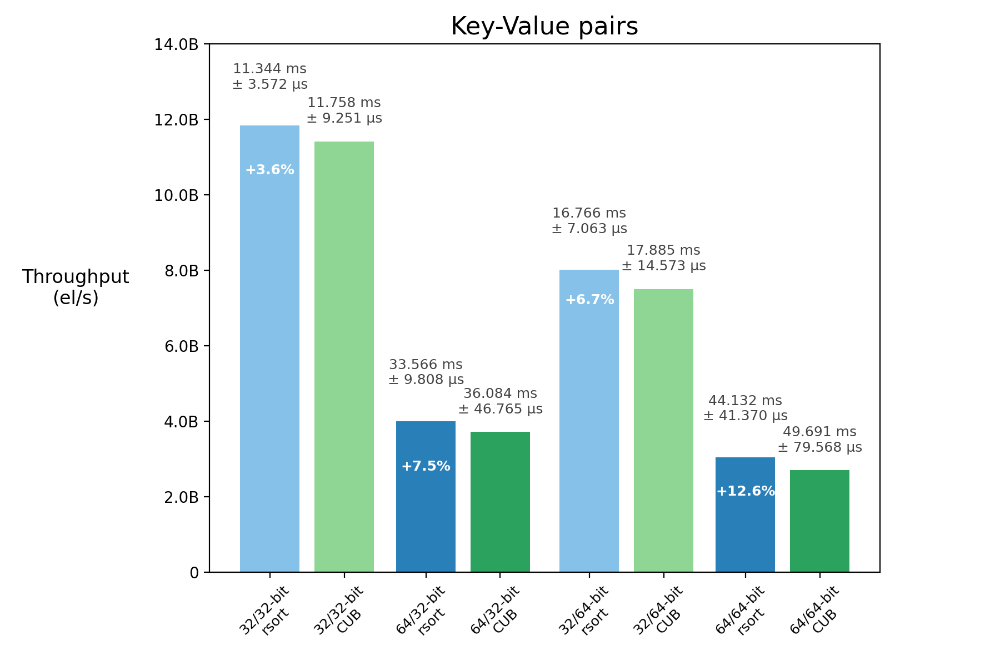
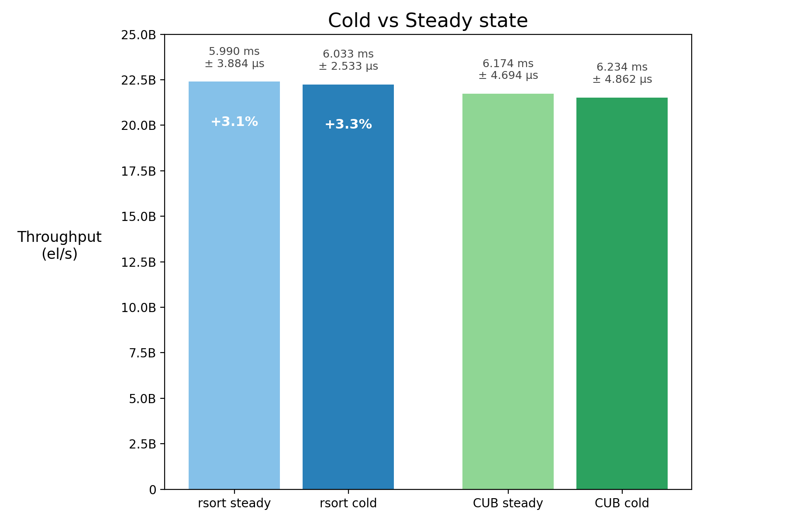
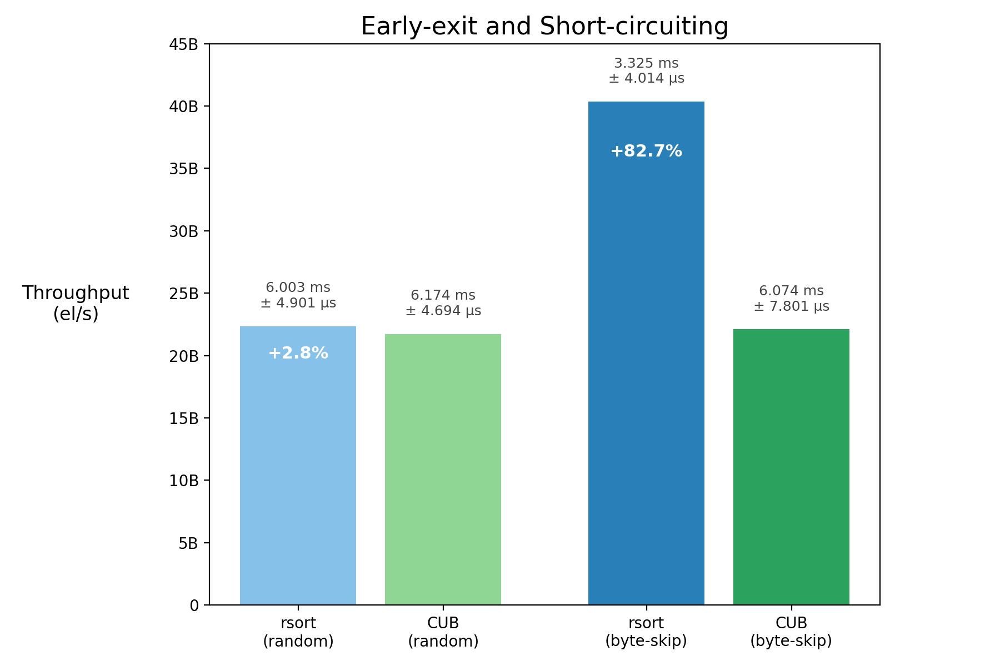
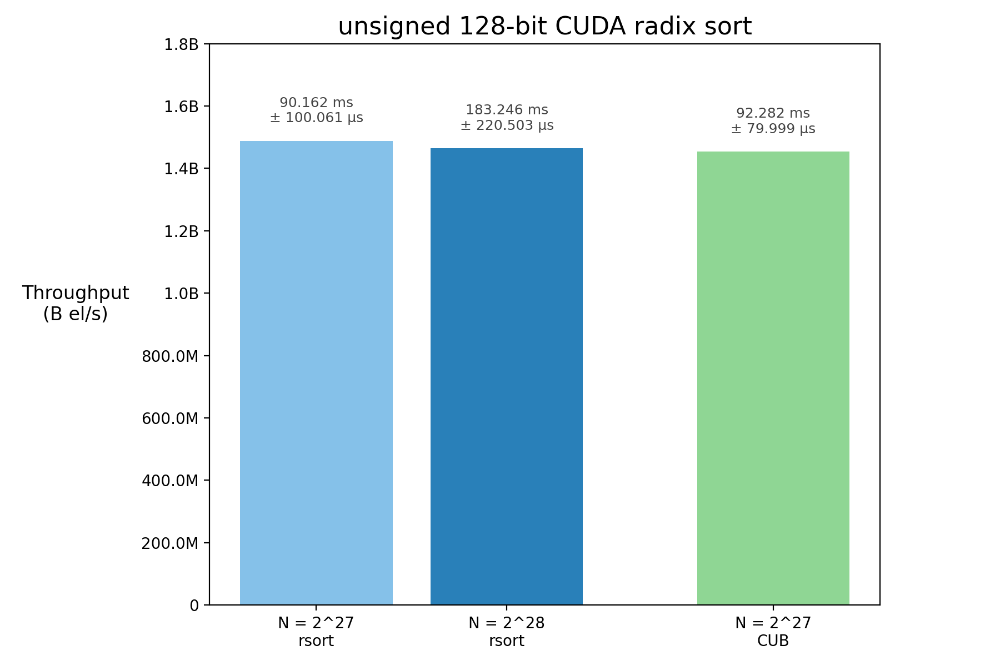

# Fast CUDA Radix Sort


A CUDA implementation of LSD radix sort based on [NVIDIA CUB's](https://github.com/NVIDIA/cccl/tree/main/cub) onesweep.

Initially motivated by the GPUOpen article on [boosting GPU radix sort performance](https://gpuopen.com/learn/boosting_gpu_radix_sort/), this project started as a small educational endeavour to get familiar with CUDA and delve deeper into C++.
The original goal was simply to build a radix sort for the GPU from scratch, without relying on third-party kernels.

However, as my understanding of CUDA and parallel programming improved, I began exploring ways to make the implementation more efficient, eventually leading me to CUB’s own implementation as a better reference point.

As it stands, this project serves both as a re-implementation and as a proof of concept for additional optimizations such as lookback epoch bits and early-exiting, without loss of generality.

Validation tests and benchmarks are included to corroborate correctness and performance against CUB, but the primary focus of the project remains on expressing the algorithms and optimizations implemented, as well as their trade-offs.

## Key Features

The implementation is based on CUB's DeviceRadixSort. It is stable, using a 8-bit radix with an onesweep design (per pass: read once, write once) and *a priori* global histogram counts. The lookback uses the classic coupled lookback chain with early publication and the addition of epoch bits.

### The algorithm currently implements:

- Keys of all the standard types <sup>1</sup>
- "semi"-arbitrary array sizes <sup>2</sup>
- Ascend/descend
- Key-value pair sorting
- Support for 128-bit keys <sup>3</sup>

<sup>1</sup> Support for all standard C++ types, including 64-bit and 128-bit **long doubles** (according to compiler defined size). 
80-bit precison **long double** representations are supported as long as the **sizeof()** reported by the compiler is 8 bytes (128-bit).

Support for unsigned types is done through the twiddling in and out of unsigned types of the same size.
This is the same idea CUB uses. Support for descending sorting is achieved using the same principle: by simply inverting the bit representation during reordering.

<sup>2</sup> Arrays with a number of elements larger than 32 bits are supported. However, in practice, each local histogram counter of each block can only count up to 32 bits. In my testing, making the atomic counter 64-bit hurt performance significantly. Still, it would take trillions of elements with the same exact key for overflow to happen, even with 32 bits counters.

<sup>3</sup> Including **long doubles**.


### Assumptions and missing features (different from CUB):

From a **proof-of-concept** perspective, some features were intentionally left out:

- No short circuiting (see section below)
- Input array is replaced with sorted output <sup>1</sup>

<!--
<sup>1</sup> Key-value support would follow a SoA approach, preserving the current key-array layout. Conceptually, this extends the scatter stage so that key moves are mirrored over the corresponding values. While this feature should be required for a production-ready sort, it is mostly independent from the optimizations already performed, so it's left for future work.
-->

<sup>1</sup> This was mainly done to test larger arrays. CUB provides two interfaces, one which preserves the input and writes to a separate output buffer, and another thadouble-buffering and drops the input remaining intact requirement. This implementation uses a standard two-buffer ping-pong scheme (equivalent to CUB double-buffering), simplifying the pipeline and avoiding additional buffer management at the performance cost of potentially overwriting the input in case the number of passes performance is odd.


## Optimizations:

### Lookback epoch bits


As far as improving performance is concerned, this optimization does a lot of the heavy lifting because it removes a full lookback buffer clear on most passes and for most scenarios.

The idea is to tag lookback entries with epoch/pass bits so the same lookback buffer can be reused across passes without having to be cleared every time. cudaMemset is cheap, but clearing, sometimes MBs of data every pass, quickly adds up, and the clear must complete before we do any more sorting work.
The lookback path is a great place to pay this extra bookkeeping cost as it is already latency-tolerant: each entry may have to wait for previous blocks to publish, which has the potential to amortize some bit logic.

In addition to the partial/global publish bits, this implementation stores epoch bits in each lookback entry. Instead of testing if ```entry == 0``` to check for an invalid state, the epoch-tagged path treats an entry as invalid when its epoch bits do not match the current pass: ```(entry & EPOCH_MASK) != pass```.  When we write both partial and global publications, we also pack the current pass in the epoch bits, so later passes ignore stale entries from earlier passes.

The epoch check might be slightly more expensive than a zero check in isolation, but in practice, the chained waiting pattern of the lookback hides most of that cost. In testing, the main downside was that the extra bookkeeping seems to make the ```__nanosleep()```'ing backoff slightly less effective, _i.e._ threads seem to sleep for fewer cycles.

We still need to initialize the lookback buffer before the first use of a given epoch value, but we can fill it with a dedicated epoch-tag pattern with 0 for the publication bits and non-zero for the epoch bits (as that is the number of the pass). That way, a matching epoch with no partial/global bits set is immediately recognized as not yet published.
The pseudocode (for the lookback) is as follows:

```python
memset lookback buffer with epoch-tag pattern
for each pass:

    ...
    publish partial state with current epoch
    ...
    wait for valid lookback state by checking epoch bits
    while lookback state is partial:
        go back a block
        wait for valid lookback state by checking epoch bits
        accumulate partial lookback
    publish global state with current epoch
    ...

    if epoch wraps:
        memset lookback buffer with epoch-tag pattern
```

With the current 32-bit epoch-tagged policy, 2 bits are reserved for epoch state (this is easily modifiable), leaving 28 value bits in the least significant part of the representation. This is the main trade-off for this optimization. In the current policy, epoch tagging is disabled for array sizes above 2<sup>28</sup>-1, and plain 32-bit lookback is used until 2<sup>30</sup>-1.
Moreover, for key sizes larger than 4 bytes, the buffer is cleared every 4th pass (excluding the last one).

For larger arrays (more than 2<sup>30</sup> elements), the implementation switches to a 64-bit lookback, with 6 epoch bits and 2 publish bits, leaving 56 bits for the actual counter. Although this doubles the lookback memory usage, sorting at this scale already requires gigabytes of VRAM, even for 8-bit key types, so the additional memory footprint isn't great in comparison. Besides, saving a couple of MBs and switching to a multi-group lookback design with worse performance didn't look like a good trade-off, especially since we are not clearing this buffer every pass anymore.

### Early-exiting

It makes sense to skip sorting work if all radices for a pass fall into the same bin.

CUB implements this idea at the block/CTA level using _short-circuiting_. Instead of checking for all radices, each block independently detects uniformity and effectively fast-forwards to the scatter stage, copying keys directly to the destination buffer.
 
The _early-exiting_ approach implemented here is much simpler and naive.
A pass is skipped entirely if all keys fall into a single radix bin, similar to what would be done in a serial radix sort (I didn't know better at the time 😄). On the GPU, detecting this condition efficiently is less straightforward.
However, we have already built a histogram for all passes before sorting. The idea is to take advantage of this computation and transfer this data to the CPU, where a compact _skip mask_ is generated (one bit per pass). Albeit simple, this approach proved to be a good value relative to its low computational cost (see benchmarking section).

The main drawback of this technique is probabilistic: it is significantly less likely for all radices in the entire array to fall into a single bin than for keys within a single block to do so. This means that, on average, _early-exiting_ triggers less frequently than block-level _short-circuiting_. 
However, when it does trigger, it skips an entire pass, leading to more substantial speedups (the onesweep kernel is not called, so no GPU work is performed for that pass, aside from the copy to host). In contrast, short-circuiting occurs more often but yields smaller gains per occurrence.

It is worth noting that this optimization is experimental and is not enabled by default (check EXIT_EARLY_OPT in the user knobs of [radix_kernel.cuh](radix_kernel.cuh)). Still, given the low overhead of generating the skip mask (_e.g._, copying and evaluating ~1 KB of histogram data for 32-bit keys assuming an 8-bit radix), I'd argue a fully-fledged GPU radix sort would ideally use both approaches together, since they operate at different levels.

### Fantastic GPU micro-optimizations and where to find them

Honestly, I don't know.

Micro-optimizations are a tricky topic in the era of modern compilers, and I'm no voodoo ~~wizard~~ child. Still, the goal of this project was to learn the underlying concepts, so almost all of the code was written from scratch rather than copied.
Because of that, each component ended up being tailored specifically for this sort. Many of the smaller changes were checked by diffing SASS dumps, which helped keep the hot path lean, even if it doesn’t exactly match what CUB or other sources do.

Some noteworthy micro-optimizations:

- **n forced to size_t** - Even though the entire kernel was written and validated to accept array sizes in any integer data type,  at some point I realized the algorithm was ever so consistently faster if _n_ was always _size_t_. I assume it has to do with casting choices improving codegen (_e.g._, fewer implicit conversions and better register usage), but I did not investigate this further as the SASS diff proved too extensive and terse.

- **__sync primitives** - Not every ```__syncwarp()``` or ```__syncthreads()``` written is needed. However, they often help with performance. In fact, in testing, I found that different combinations of sync primitives along a given kernel, even if not strictly required for correctness, can sometimes yield better performance gains, mainly due to subtle changes in warp scheduling and thread-pacing (the main reorder kernel is a good example).

- **PTX instructions** - In some areas, it is worth getting your hands dirty and writing some raw assembly. As a matter of fact, in the case of ```__match_any_sync()``` this is more a performance requirement rather than a micro-optimization, as the radix label is only 8 bits (in our case), so there is no need to match on a whole 32-bit register, and this falls right in the ballot-counting hot path of the ranker. Other small lane helpers also use PTX, though mostly to avoid including extra CUB libraries (also helps reduce compilation times).


## API Interface

The API exposes 4 main entry points for combinations of standard/KV-pair sorting, and acsending/descending sorting:


- **onesweep_byte_sort** - Sort an array of keys only in ascending order.

- **onesweep_byte_sort_descending** - Sort an array of keys only in descending order.

- **onesweep_byte_sort_pairs** - Sort an arrays of keys, along with a second array of corresponding values, in ascending order.

- **onesweep_byte_sort_pairs_descending** - Sort an arrays of keys, along with a second array of corresponding values, in descending order.


#### Arguments (in order):
  - `d_inout <Key_T*>` - Input array of `n` elements of type `Key_T` (check validation types). Sorted output is written here. 
  - `d_inout_values <Value_T*>` - [Only for the KV-pair sorting interfaces]. Input array of `n` elements of type `Value_T`. There are no restrictions for the size or type of `Value_T`.
  - `temp_bytes <size_t*>` - If null, a call to any of the interfaces will solely calculate the size in bytes of the workspace buffer needed to perform sorting and return. Otherwise, performs the sort.
  - `d_workspace <uint8_t*>` - Helper memory region compromised of an extra ping-pong buffer for sorting out-of-place, a lookback buffer, histogram counters, as well as any other data needed for sorting.
  - `n <Len_T>` - Size of input array in number of elements. `Len_T` should be an integral type.
  - `capture_stream <cudaStream_t>` - [Optional: Deafult = `nullptr`] If not null, a CUDA graph will be created for the kernel operation of the algorithm, in which case `capture_stream` must be valid.


## Compilation and Usage 

#### Compile with:
```bash
nvcc -O3 -std=c++17 -arch=sm_86 radix_gpu.cu bench_parser.cpp -o radix_gpu(.exe)
```

#### Run:
```bash
./radix_gpu
```

#### Command-line flags

-   `--n <value>`: Number of elements `[default = 2^27]`
-   `--iterations <value>`: # of timed iterations `[default = 30]`
-   `--warmup <value>`: # of warmup iterations `[default = 10]`
-  `--warmup_ms <value>`: Minimum warmup time (in milliseconds) `[default = 10]`
-   `--descending`: Sort in descending order `[default = false]`
-   `--validation`: Run validation instead of benchmark `[default = false]`
-   `--help`: Show available flags


#### Example benchmark run:
```bash
./radix_gpu --n 10000000 --iterations 30 --warmup 10
```
Performs a benchmark run, sorting an array of 10M random elements, showing the results of an average of 30 runs, with at least 10 runs of warmup.


## Benchmarks

### Setup

Configuration used for all  experiments:

- **Hardware:**
	- **GPU** - NVIDIA GeForce RTX 3080 Ti <sup>1</sup>
		- Ampere (sm_86)
		- 12 GB GDDR6X (stock clocks)
	- **CPU** - 13th Gen Intel i7-13700K
- **Software:**
	- **CUDA**
		- **Version** - V13.1.115
    	- **Build** - cuda_13.1.r13.1/compiler.37061995_0
	- **Driver** - 580.126.09
	- **OS** - Ubuntu 24.04.4 LTS x86_64
	- **Kernel** - 6.17.0-22-generic
- **Compilation:**
	- **nvcc flags** - -O3 -arch=sm_86

<sup>1</sup> No background processes running; headless (no displays attached).
	
### Data collection

Unless expressed otherwise, all collected data points represent an average of 30 runs, with a warmup of at least 250 ms (or 10 runs, whichever takes longer). This will be referred to as the _steady-state_ configuration.
The warmup metric was chosen with the goal of tightening the standard deviation between runs as much as possible, not to bias any of the approaches.
In addition, all experiments correspond to sorting unsigned keys in ascending order, randomly initialized with a standard avalanche bit mixer (check _init_keys_ kernel in [utils.cuh](radix/utils.cuh)).  All graphs show throughput instead of timings in number of elements sorted per second - _el/s_). This project's implementation is referred to as _rsort_.

### Scaling Behavior

For 32-bit keys, rsort is faster across all tested array sizes, from 2<sup>20</sup> to 2<sup>29</sup> elements. Speedups are more pronounced for smaller arrays, starting in the double digits and eventually stabilizing around 3% as peak throughput is reached. Peak throughput for rsort is reached around 22.4B el/s for 2<sup>27</sup> elements. CUB peaks slightly lower, at around 21.9B el/s reached at 2<sup>28</sup> elements.
It's interesting to note the drop in throughput from 2<sup>28</sup> elements onwards for rsort, as it coincides with the policy change that disables epoch bits in the lookback path. Surprisingly, rsort still leads by around 2% with epoch bits turned off.  For 32 bits, rsort uses 21 items per thread and 384 threads per block, which, as far as I can tell, is the same CTA geometry CUB uses for this scenario in sm_86. Rsort pipeline being optimized for an 8-bit radix onesweep makes a strong case against CUB's more general policies, at least for high-throughput scenarios. Lookback epoch bits seem to provide the largest relative advantage for smaller arrays.

<p align="center">
  
  
</p>

For 64-bit keys, the story changes slightly. CUB starts behind by a more modest margin for smaller arrays (mainly sizes 2<sup>21</sup> and 2<sup>22</sup>), but the margin widens in favor of rsort for larger arrays. rsort uses 448 threads per block and 6 items per thread to sort 64-bit keys; changing the policy to match CUB's geometry seems to yield very similar results. Changing other knobs in Rsort's reorder and lookback policy does not seem to move performance significantly either. Eventually, rsort reaches a 5.4% performance gain with a peak throughput of around 6B el/s, before falling to a 4.5% gain when turning off the lookback epoch policy, at an array size of 2<sup>28</sup>. CUB's throughput peaks at around 5.69B el/s.

Overall, standard deviations seem to be tighter for rsort across most sizes, although for 64-bit keys, CUB seems to present less jitter on average (check [benchmark_data](graphs/benchmark_data.py)). Worth noting that, in my testing, even using an average of 30 runs along with a hefty warmup configuration, standard deviation still varies significantly from run to run, so it is better to focus on the global picture and not read too much into specific values.

<p align="center">
  
  
</p>

For 8 and 16 bits, rsort wins more clearly all around. The CTA geometry used by rsort for both cases is the same as for 32 bits. As far as I could tell, CUB does not use onesweep for keys smaller than 32 bits on sm_86, and the radix is also smaller than 8 bits. I'm not sure of the reasons behind this choice. Perhaps memory management, although looking at memory consumption, the two algorithms do not seem significantly different. Still, this means these two graphs are not comparing implementations of the same algorithm at all anymore.

For 8-bit keys, initial gains for smaller arrays range from 30% to 50% (except for arrays of size 2<sup>21</sup>), eventually dropping down to a 20% performance lead at a peak throughput of around 88.5B el/s reached for an array of 2<sup>29</sup> elements. Performance then drops again to 16%-17% from sizes 2<sup>30</sup> onwards, as rsort's lookback policy is forced into 64 bits. Interestingly, we don't see the same behaviour of dropping throughput when disabling lookback from sizes 2<sup>28</sup> to 2<sup>30</sup> that we saw for 32 and 64 bits. This is possibly explained by the smaller keys requiring larger array sizes to achieve peak throughput numbers. In fact, even at N = 2<sup>31</sup>, CUB is still peaking throughput at around 73.7B el/s.

It is also worth mentioning the peak in throughput that happens at N = 2<sup>21</sup> for CUB. This appears to be an artefact of memory and how data fits in the GPU rather than an algorithmic quirk. In fact, at 1 byte per element and only 1-2M elements, I'd argue the most likely explanation is that the whole array and workspace memory fits in the GPU's L2 6MB cache. This is further corroborated by the fact that timings are almost identical for arrays of 2<sup>20</sup> and 2<sup>21</sup> 8-bit elements.

For 16 bits, rsort's performance gains are more pronounced, reaching a 117% speedup for N = 2<sup>22</sup>, eventually stabilizing at around a 70% at a peak throughput of 59.5B el/s for an array of 2<sup>29</sup> elements. The same situation seen in the 8-bit scenario then happens when the lookback is forced into 64 bits for array sizes of 2<sup>30</sup> onwards. In turn, CUB reaches a peak throughput of around 35.1B el/s for N = 2<sup>30</sup>.
It is interesting to note that if we think about throughput in sorted bytes per second instead of sorted elements per second, we see that, for 8 bits, 88.5B bytes/s is close to the 22.4 x 4 = 89.6B bytes/s figure we saw for 32-bit (4 bytes) peak throughput. However, the throughput for 16-bit keys is considerably higher, reaching a peak of 59.5 x 2 = 119B bytes/s, or 110.8GB/s, or (setting aside the parallelism of things for a minute) an even crazier 8.40 picoseconds per sorted byte! Enough for light to travel a bit more than 2mm. Remember this the next time your favourite AAA title dips below 60 fps... maybe the hardware isn’t the only thing to blame! 😀  
 

### Key-Value pairs

For key-value pair sorting, the data being scattered at the end of each pass needs to be staged before it is written out. rsort supports different staging modes for keys and values. Staging can be done directly, by storing the actual key or value, or indirectly, by storing indices and then using an intermediate step to recover the corresponding data.
Indirect staging adds extra work, so it usually has a performance cost. However, for larger keys or values, it can still be faster by reducing overall memory bandwidth or by reducing shared-memory usage, which in turn may allow better kernel geometry.
In practice, keys are almost always staged directly. Values are staged directly by default, and only staged indirectly when the combined size of the key and value is large enough that direct staging becomes too expensive.

<p align="center">
  
</p>

The graph shows the results of sorting a combination of 32 and 64-bit keys and values, in rsort and CUB, for an array size of 2<sup>27</sup>.
The current rsort policy stages all keys and values directly for all these test cases.
For 32-bit keys and values, rsort achieves a throughput of 11.8B el/s, outperforming CUB's 11.4B el/s by 3.6%. As the size of the key-value pair increases, the advantage of rsort becomes more pronounced. For 64-bit keys with 32-bit values, the lead grows to 7.5%, while for 32-bit keys with 64-bit values, rsort is 6.7% faster. 64-bit keys obviously take more time in general as the number of actual radix passes doubles.
The largest improvement is observed when sorting 64-bit keys paired with 64-bit values, where rsort reaches 3.04B el/s and outperforms CUB's by 12.6%.


### Cold vs. Steady state

These benchmarks were carried out in _steady-state_ with significant warmup. This means the code caches and paths are pre-loaded and hot. Even though this is typically how most performance benchmarks are performed (especially for GPUs), there is value in testing algorithmic performance on more realistic conditions. A user calling a sort algorithm is most likely to do some other work after with the sorted output, possibly even outside the GPU. The above bar graph shows the results of running both states, again for an unsigned 32-bit array of size 2<sup>27</sup>. The _cold-state_ consists of 1 single run with no warmup of any kind. Results still correspond to an average of 30 runs performed individually and spaced out in time sufficiently to cool the GPU.

<p align="center">
  
</p>

In this experiment, CUB achieves a throughput of 21.7B el/s on _steady-state_ vs. 21.5B el/ for  _cold-state_, corresponding to a performance drop of around 1%. In turn, rsort manages 22.4B el/s for _steady-state_ vs 22.2B el/s on _cold-state_, which translates to a 0.9% drop. This corresponds to an advantage of around 3.2% for rsort in _steady-state_ and 3.3% in _cold-state_. 
Standard deviations are just slightly tighter for rsort in both states. However, to establish a pattern for _cold-state_ would necessitate more extensive scaling benchmarking, as done for _steady-state_.

### Short-Circuiting vs. Early-Exiting


For this experiment, we are again using _steady-state_ with 32-bit arrays of 2<sup>27</sup> elements. Here, instead of randomly initializing the entire value, only every other byte is randomly initialized, the remaining ones being filled with the same patterns for all keys. This scenario is beneficial for rsort's early-exiting approach, as 2 of the bytes will be marked for skipping. However, CUB's CTA-level short-circuiting should also fast-forward the work of every block that handles the constant-valued bytes to the scatter stage for copying. The idea is to make both mechanisms trigger half of the time in order to compare speedups. Besides, many real-world applications tag bit information in a specific location or bytes of the data (_i.e._ the lookback mechanism of both these algorithms, for instance), making this scenario not so far-fetched.

<p align="center">
  
</p>

Results show a throughput increase from 21.7B to 22.1B el/s (+1.6%) for CUB when switching from random to byte-skipped arrays. This was somewhat surprising to profile, as I assumed the work skipped would be much closer to 50%. Still, not performing any GPU work for 2 of the 4 bytes should have rsort decrease timings to about half, giving it an advantage. Indeed, results show that rsort's throughput jumps to about 40.4B el/s when sorting byte-skipped arrays in this scenario.
As for array mode variance, results show a 2.8% performance gain for random arrays (with early-exiting enabled) against CUB, and 82.7% for short-circuiting versus early-exiting in byte-skipped arrays.

Paying attention to the baseline random initialization results for rsort might raise the question as to why the timings are not 6.003 ms instead of the 5.983 ms seen in the last test with the same setup. This is because early-exiting is not enabled by default in rsort, and in this scenario, we are paying the cost of this mechanism explicitly. Still, in testing, the measured cost for early-exit stayed within the 10-25 µs range (20 µs here), so it's safe to say that it's not an overtly expensive optimization to perform. Also, note that the performance cost of early-sxiting is solely linearly dependent on the number of passes, and constant otherwise.

I think it is worth noting that the comparison between these mechanisms should not invalidate either of them, as they are mutually exclusive and operate at different levels (globally vs CTA). Therefore, any implementation definitely could, and probably should, benefit from implementing both techniques. 


### 128-bit results

This scenario consists of a preliminary experiment for sorting 128-bit arrays (again, unsigned keys, _steady-state_). Ultimately, this should be a scaling graph like the first four, but to avoid cluttering this benchmarking section and sparing my poor GPU of further torture, let's stick with the sizes with the highest potential for peak throughput that fit in GPU VRAM, not causing OOM errors.
For array sizes of 2<sup>26</sup> elements, rsort achieves a throughput of around 1.49B el/s when compared to CUB's 1.46B el/s, representing a speedup of around 2.1%.
For N = 2<sup>27</sup>, rsort's throughput remains roughly the same, while CUB's decreases slightly to 1.45B el/s, translating to a speedup of 2.3%.

<p align="center">
  
</p>

<!--
Disclaimer: Here we are not comparing with CUB's DoubleBuffer, meaning the input preserving requirement makes it so that sorting this many 128-bit elements exceeds available VRAM, resulting in OOM. 
-->
Standard deviations for CUB seem to hint towards less jitter than rsort for this scenario. Again, further scaling tests are needed in order to assert this.


### TL;DR

- Competitive performance for 32 and 64-bit keys (~2–4% gains at peak throughput).
- Strong performance gains for small key sizes (especially 16-bit).
- Scaling behaviour identical to CUB, with minor differences due to lookback policies.
- Optimizations described reduce runtime (significantly in more favourable scenarios).
- Performance gains in both _steady_ and _cold_ states.
- Low run-to-run variance, also identical to CUB, overall.
- 


## Validation

To ensure the correctness of the implementation, a validation suite is provided to test sorting across a range of different scenarios. A full validation run consists of sorting arrays of all data types, for every array mode (random and byte-skipped initialization) and sort orders (ascending and descending). Array sizes span from the largest power of 2 that fits the GPU VRAM (including workspace memory), down through 11 successive halvings. There are also tests for smaller arrays with as little as 10 elements.

The full validation includes the follwing data types: ```uint8_t, uint16_t, uint32_t, uint64_t, int8_t, int16_t, int32_t, int64_t, float, double``` for every plataform, with the addition of ```long double, __int128 and unsigned __int128``` for GCC/Clang, totalling 6552 test cases (on Linux).

Each test performs order checks on the sorted elements (manifested value), radix count histogram checks over the whole array, as well as pairing and stability checks (through unisgned/identity values) when sorting Key-Value pairs with indices for value data.

### Example validation run:
```bash
./radix_gpu --validation --iterations 1 --warmup 0
```
Performs a validation run, calling a single benchmark with no warmup for all defined array modes, for all defined sizes, including descending, and for every defined data type.

### Notes (READ!):

- Full validation was run on Ubuntu 24.04 LTS and Windows 11.
- Due to heavy template instantiation, validation is disabled by default, as it can take over 2 minutes, even on modern CPUs. The toggle is the single "VALIDATION_TEST" macro at the start of the main file. However, normal "one type, one scenario" compilation shouldn't take more than a few seconds at most.
- You can use the macros at the start of [validate_sort.cuh](validate_sort.cuh) to change the set of data types to check validation for. Some other standard subsets are provided, or you can define your own.

## Failed Experiments

 - **Multi-lookback** - Learning about the chained lookback, at first, does not seem like the most efficient structure. Basically, block 0 must publish something, even if partially, before any lookback work is done. I experimented with a multi-group lookback where every group gathers information independently, reducing contention on a single chain and paying a small prefix sum cost at the end. Sounded good... doesn't work. Or at least I didn't manage to reduce performance with it. 
 
 - **Ranker** - A lot of time was spent trying to optimize the ranker to no avail. I eventually decided to keep my sanity and checked CUB’s approach 😀 This is probably the component that more closely matches it. 

 -  **Circular buffer** - The [GPUOpen article](https://gpuopen.com/learn/boosting_gpu_radix_sort/) that motivated this project describes a decoupled lookback using a circular buffer. After much effort to reproduce this approach, I could not achieve consistent performance comparable to the coupled variant, so I abandoned the idea.

## Releases

Checklist of standardization efforts for all major vN.N releases from version v0.2.0 onwards:

  - Validation suite passes all test in both Windows (MSVC) and Linux (gcc):
      - Linux: 6552/6552 tests passed (long doubles, signed and unsigned 128-bit integers).
      - Windows: N/M tests passed.
  - Compilation of all templating (validation) must return no warnings with both `-std=c++17` and `-std=c++20` flag standards, for Windows (MSVC), and for Linux (gcc).
  - Updated [monolithic header](monolithic/rsort.cuh).
  <!-- - Updated benchmarking data. -->

## Notes and Disclaimers

- While extensively tested and benchmarked, rsort has not yet received the level of platform coverage, validation, long-term maintenance and overall battle-tested'ness expected of a production library.
- For convenience, a monolithic single-header version is provided in [monolithic/rsort.cuh](monolithic/rsort.cuh). The main implementation remains split across files for readability. This monolithic version might not be up to date with development!
- The implementation was tested on a single GPU (mine). Cross-device results may vary.
- The optimizations explored here are, to the best of my knowledge, not widely documented in existing GPU radix sort literature, hence this project.
- Part of the point of this implementation was to prove the optimizations can be carried out without loss of generality and without getting in the way of other features.
- Performance was mesured with release 1 of this repository. Since then, some optimizations were done, mainly to shared memory reuse and kernel geometry, that might change performance (increase in most cases).

## TODOs

- Investigate performance for arrays smaller than 2<sup>20</sup> elements. Preliminary testing seems to indicate performance continues to scale down.
- Investigate integrating or aligning with benchmarking approaches used in NVIDIA/cccl to improve consistency. I wasn't aware of the bench suite when writing this benchmark.
- **Optimizations**: Some ideas for ranker work distribution still to test; lookback configurations; improve memory alignment overall; etc. 
  

## Sources

- Boosting GPU Radix Sort performance: A memory-efficient extension to Onesweep with circular buffers - https://gpuopen.com/learn/boosting_gpu_radix_sort/
- Onesweep Radix Sort - https://developer.download.nvidia.com/video/gputechconf/gtc/2020/presentations/s21572-a-faster-radix-sort-implementation.pdf
- NVIDIA CCCL - https://github.com/NVIDIA/cccl/tree/main/cub
- CUDA docs - https://docs.nvidia.com/cuda/cuda-runtime-api/index.html
- Several CUDA YouTube talks - https://youtu.be/GmNkYayuaA4?t=430 - I'm available if the offer still stands 🙂
<!--
<pre>
																								🫳
																									🎤
</pre>
-->

## Contact

Email: fjrbaeta@gmail.com 

